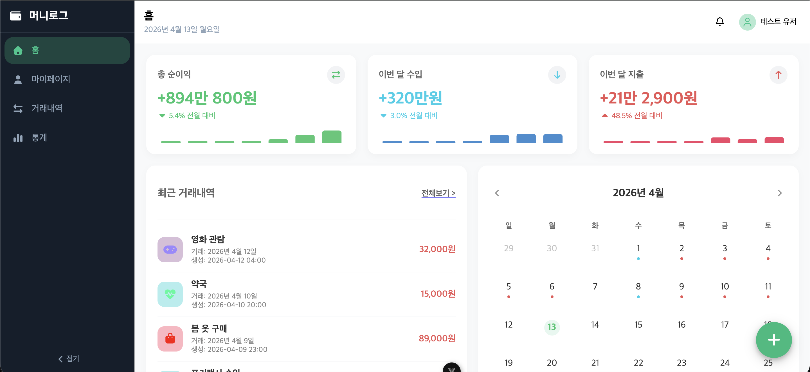
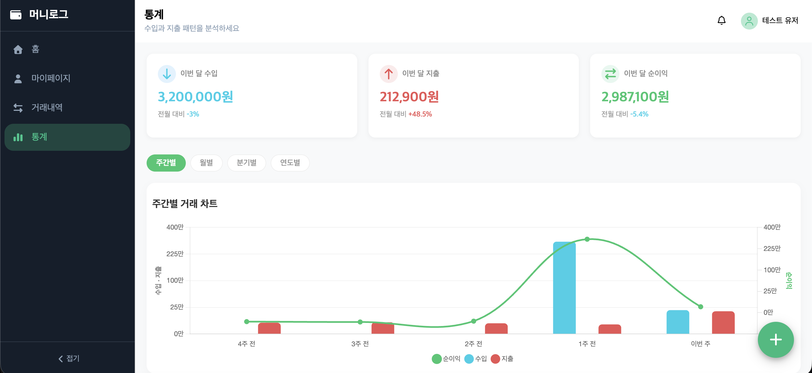
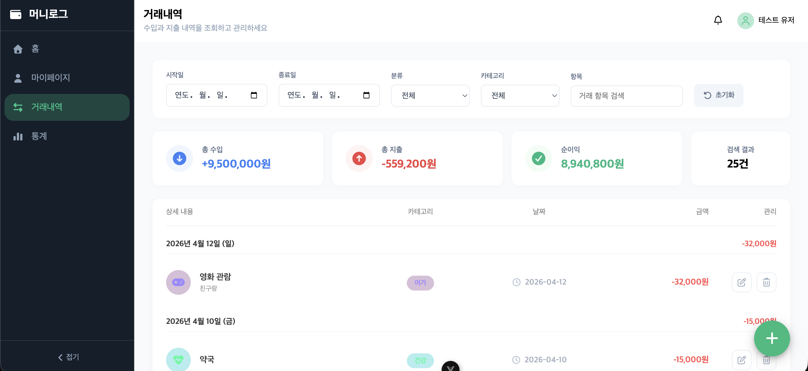
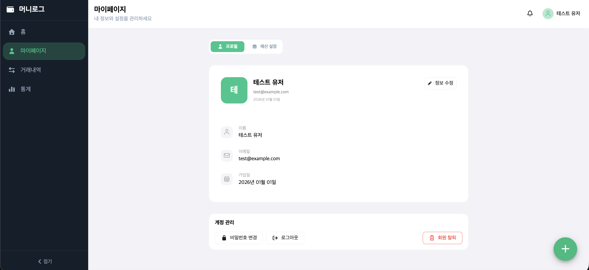

# 💸 머니로그

> **나만의 체계적인 자산 관리 파트너**  
> 직관적인 통계와 대시보드를 통해 소비 패턴을 분석하고 체계적으로 자산을 관리할 수 있는 스마트한 가계부 웹 애플리케이션입니다.

<br/>

## ✨ 주요 기능 (Key Features)

- **📊 한눈에 보는 대시보드**: 수입과 지출 흐름을 직관적으로 파악할 수 있습니다.
- **📝 간편한 내역 관리**: 언제 어디서나 손쉽게 수입, 지출 내역을 기록하고 카테고리/결제 수단별로 관리합니다.
- **📈 상세한 통계 분석**: 카테고리별 도넛 차트(`Chart.js` 활용) 및 기간별 통계를 통해 나의 소비 패턴을 정확하게 분석합니다.

<br/>

## 📸 스크린샷 (Screenshots)

|                 대시보드 (Dashboard)                 |                통계 분석 (Statistics)                |
| :--------------------------------------------------: | :--------------------------------------------------: |
|     |  |
|             **내역 관리 (Transactions)**             |               **마이페이지 (My Page)**               |
|  |          |

<br/>

## �️ 기술 스택 (Tech Stack)

### Frontend

- **Framework**: Vue 3 (Composition API)
- **Build Tool**: Vite
- **State Management**: Pinia
- **Routing**: Vue Router
- **HTTP Client**: Axios
- **Chart**: Chart.js, vue-chartjs

### Backend / Mock Server

- **Mock Server**: json-server

<br/>

## 🚀 시작하기 (Getting Started)

### 1. 프로젝트 클론 및 의존성 설치

```bash
# 의존성 패키지 설치
npm install
```

### 2. Mock 서버 실행 (json-server)

백엔드 API를 모방하기 위해 로컬에서 `json-server`를 실행해야 합니다.

```bash
# server 디렉토리의 db.dev.json (또는 db.json)을 기반으로 실행
npx json-server --watch server/db.dev.json --port 3000
```

_(참고: 프로젝트 `package.json`의 스크립트 설정에 따라 `npm run server` 등의 명령어로 대체할 수 있습니다.)_

### 3. 프론트엔드 개발 서버 실행

```bash
# Vite 개발 서버 실행
npm run dev
```

이후 브라우저에서 `http://localhost:5173` (Vite 기본 포트)로 접속하여 애플리케이션을 확인할 수 있습니다.

<br/>

## 📁 프로젝트 구조 (Project Structure)

```text
money-log/
├── public/             # 정적 리소스 파일
├── server/             # json-server용 Mock 데이터 파일 (db.json, db.dev.json)
├── src/
│   ├── api/            # Axios 클라이언트 및 API 호출 함수
│   ├── assets/         # 이미지, CSS 등 정적 에셋
│   ├── components/     # 재사용 가능한 UI 컴포넌트
│   ├── composables/    # Vue Composables (useCategoryStats 등)
│   ├── constant/       # 에러 코드, 상수 등 관리
│   ├── stores/         # Pinia 상태 관리 (auth 등)
│   ├── utils/          # 유틸리티 및 검증 함수 (validators)
│   ├── views/          # 페이지 컴포넌트 (Home.vue 등)
│   ├── App.vue         # 최상위 컴포넌트
│   └── main.js         # Vue 앱 진입점
└── package.json        # 프로젝트 의존성 및 스크립트 설정
```

<br/>
